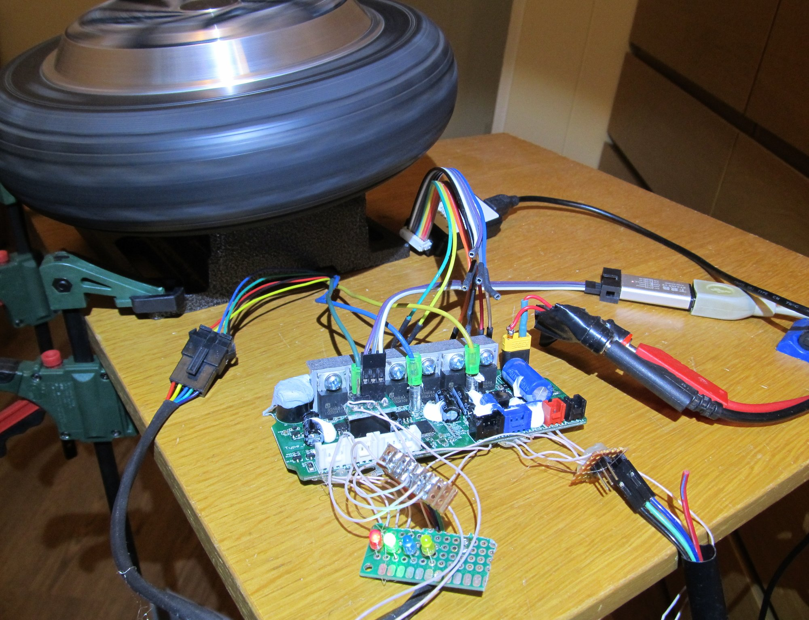
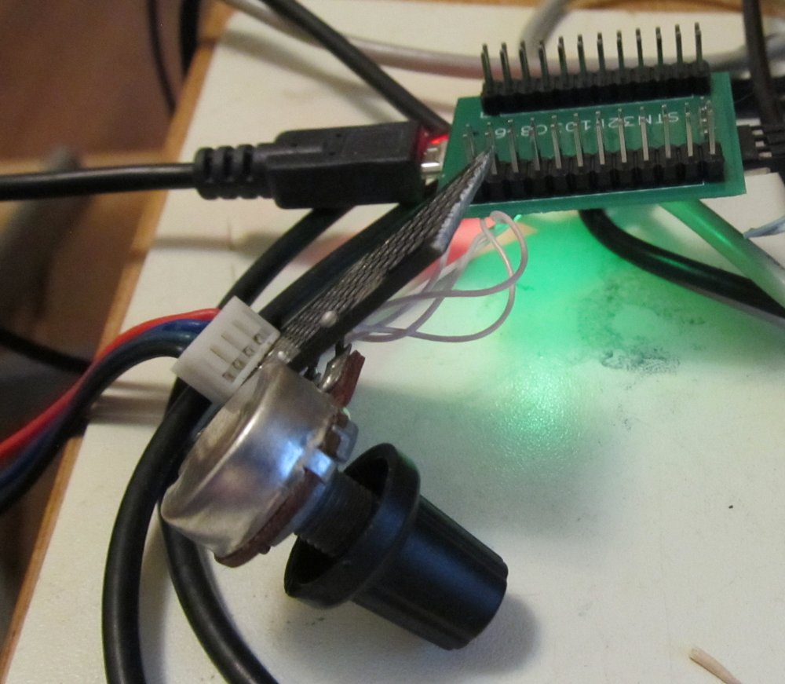
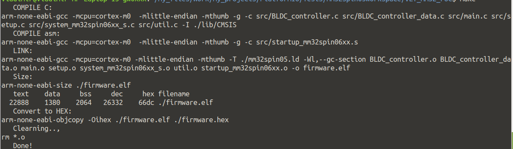
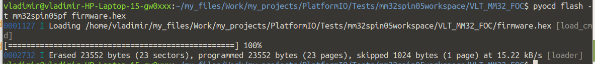
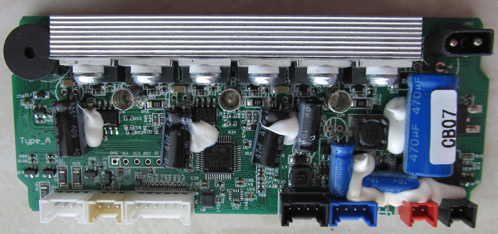
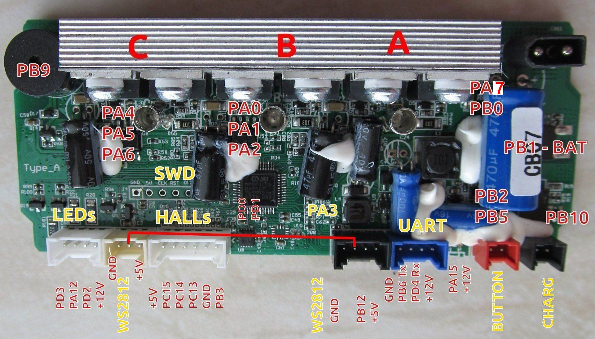
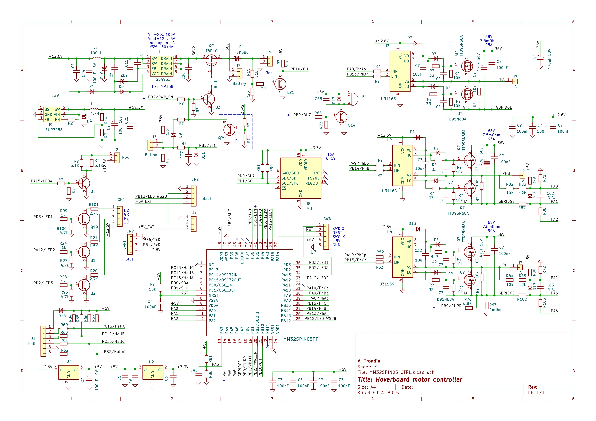

# MM32SPIN05 based Hoberboard hack

This project is EFeru Hoverboard hack clone for MM32SPIN05 (https://github.com/EFeru/hoverboard-firmware-hack-FOC)

Only UART control is functional.
Please check here https://github.com/EFeru/hoverboard-firmware-hack-FOC/tree/main/Arduino/hoverserial for details.

TRQ_MODE and SPD_MODE are not functional because of hardware limitation - looks like originally board was designed for MCU with integrated opamp.

Visual Studio code with Platformio plugin can be used for code design, but it generates not functional binary.
Please use "make" to compile sources.

Use "pyocd flash -t mm32spin05pf firmware.hex" to upload binary.

GCC compilation for MM32SPIN05 adapted by me, based on Mindmotion packet for Keil uVision.
If any mistakes - feel free to fix yourself.

Board view:

Pinout:

Schematic:

I am sorry about mistakes in the reversed schematic, if any :)

Disclaimer:
no guarantee, no support.

